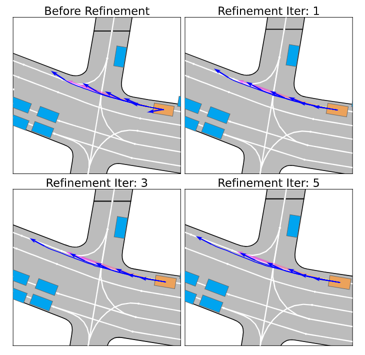

# SmartRefine: A Scenario-Adaptive Refinement Framework for Efficient Motion Prediction

**_Fast Takeaway_:** We introduce a novel approach to refining motion predictions in autonomous vehicle navigation with minimal additional computation by leveraging scenario-specific properties and adaptive refinement iterations.

> Yang Zhou\* , [Hao Shao](http://hao-shao.com/)\* , [Letian Wang](https://letianwang0.wixsite.com/myhome) , [Steven L. Waslander](https://www.trailab.utias.utoronto.ca/stevenwaslander) , [Hongsheng Li](http://www.ee.cuhk.edu.hk/~hsli/) , [Yu Liu](https://liuyu.us/)$^\dagger$.

This repository contains the official implementation of [SmartRefine: A Scenario-Adaptive Refinement Framework for Efficient Motion Prediction](https://arxiv.org/abs/2403.11492) published in _CVPR 2024_.

[](https://hits.seeyoufarm.com)
[](https://github.com/tatsu-lab/stanford_alpaca/blob/main/LICENSE)

## News
- `[22 Mar., 2024]` We released our code for [Argoverse 1](https://github.com/argoverse/argoverse-api). Give it a try!
- `[18 Mar., 2024]` We released our SmartRefine paper on [<u>_arXiv_</u>](https://arxiv.org/abs/2403.11492).
- `[27 Feb., 2024]` Our SmartRefine was accepted by _CVPR 2024_.

## Getting Started
1\. Clone this repository:
```
git clone https://github.com/opendilab/SmartRefine.git
cd SmartRefine
```
2\. Install the dependencies:
```
pip install -r requirements.txt
```
You can selectively configure the environment in your favorite way.

3\. Install the [Argoverse-API]() and download the [Argoverse Motion Forecasting Dataset v1.1](https://www.argoverse.org/av1.html) following the corresponding User Guide.

4\. Download the prediction backbone's outputs at [Here](https://openxlab.org.cn/datasets/kmzy99/SmartRefine/tree/main/prediction_data). After downloading and extracting the zip file, the prediction data should be organized as follows:
```
/path/to/p1_data_root/
├── train/
|   ├── 1.pkl
|   ├── 2.pkl
|   ├── ...
└── val/
    ├── 1.pkl
    ├── 2.pkl
    ├── ...
```
Here, each pickle file contains the backbone model's outputs: predicted trajectories with a shape of $[K, T, 2]$ and trajectory features shaped as $[K, -1]$, where $K$ is the number of modalities and $T$ is the trajectory length.

5\. **[Optional]** Generate your own model's prediction outputs.

As mentioned in our paper, SmartRefine is designed to be decoupled from the primary prediction model backbone, and only requires a generic interface to the model backbone (predicted trajectories and trajectory features). Therefore, we present a script `eval_store.py` as an example to show how to store the backbone's outputs. The main idea is to store predicted trajectories with a key of 'traj' and trajectory features as 'embed' into a dictionary.

## Training
You can train the model on a single GPU or multiple GPUs to accelerate the training process:
```
set -x
# change root to your path of dataset root.
data_root=YOUR_DATASET_ROOT_DIR
# change p1_root to your path of prediction outputs root.
p1_root=YOUR_PREDICTION_DATA_ROOT_DIR
# experiment name used for logging.
exp=smartref_hivt_argo1
# device number.
ngpus=8
pwd

python train.py \
       --data_root $data_root --p1_root $p1_root --exp $exp \
       --gpus $ngpus --embed_dim 64 --refine_num 5 --seg_num 2 \
       --refine_radius -1 --r_lo 2 --r_hi 10 \
```
**_Note_**: The first training epoch will take longer because it preprocess the data at the same time. The regular training time per epoch is around 20~40 minutes varied by different hardware.

The training process will be saved in `$exp/lightning_logs/` automatically. To monitor it:
```
cd $exp
tensorboard --logdir lightning_logs/
```

## Evaluation
To evaluate the model performance:
```
set -x
# change root to your path of dataset root.
data_root=YOUR_DATASET_ROOT_DIR
# the version directory of the experiment name used in training.
ckpt_version=smartref_hivt_argo1/lightning_logs/version_xxx/
pwd

python eval.py \
       --data_root $data_root --ckpt-path $ckpt_version \
       --refine_num 5 --refine_radius -1 \
```
## Results
### Tabular Results
The expected performance is:
| Methods      | minFDE | minADE | MR   |
| ------------ | ------ | ------ | ---- |
| HiVT         | 0.969   | 0.661   | 0.092 |
| HiVT w/ Ours | 0.913   | 0.646   | 0.083 |
### Visualization Results
The dark blue arrows are multi-nodal predictions of the agent by model and the pink arrow is the ground truth future trajectory respectively. The shortest trajectory gets more aligned toward the ground truth direction, and the trajectory closest to the ground truth gets closer after refinement.


## Citation
If you find our repo or paper useful, please cite us as:

```bibtex
@misc{zhou2024smartrefine,
      title={SmartRefine: A Scenario-Adaptive Refinement Framework for Efficient Motion Prediction}, 
      author={Yang Zhou and Hao Shao and Letian Wang and Steven L. Waslander and Hongsheng Li and Yu Liu},
      year={2024},
      eprint={2403.11492},
      archivePrefix={arXiv},
      primaryClass={cs.CV}
}
```

## Acknowledgements

This implementation is based on code from other repositories.
- [HiVT](https://github.com/ZikangZhou/HiVT)
- [LMDrive](https://github.com/opendilab/LMDrive)
- [Forecast-MAE](https://github.com/jchengai/forecast-mae)

## License

All code within this repository is under [Apache License 2.0](https://www.apache.org/licenses/LICENSE-2.0).